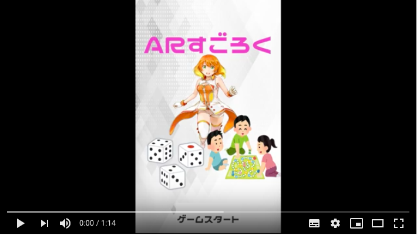
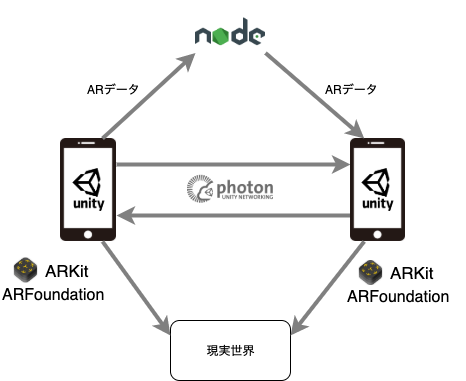

# ARすごろく

## 製品説明
### X Tech
放課後のアソビ × tech

### 背景（製品開発のきっかけ、課題等）
せっかく友達で集まったなら何か一緒にできることをしたい、という中高生の悩みを解決するためにこのアプリを開発しました。

近年ソーシャルゲームなど、スマホで一人で遊ぶゲームが流行し、「**友達と一緒にゲームをする**」という習慣が無くなってきたように思われます。  
そこで、スマホさえあれば遊べるようなパーティーゲームがあれば、と考えたのです。

そこで注目したのが**スゴロク**です。  
スゴロクはルールは単純で**誰もが知っている**し、勝敗について運によるところが大きく、パーティーゲームとして最適です。  
さらにこれをARで行うことにより中高生の興味を惹くこともできます。  
以上が私たちがこのアプリを開発した理由です。

### 製品説明（具体的な製品の説明）
ARスゴロクは、その名の通りAR機能を使い、**現実世界の中でスゴロクをすることができるアプリ**です。
#### ゲームの流れ
1. アプリを起動
2. 四人組でプレイする。一人がホストした部屋に他の三人が入る。
3. ルートを決める一人が選ばれ、その一人が**AR空間を歩き回り、通った道がスゴロクのルート**となる。
（ここでスゴロクのルートはプレイヤーの足元に生成され、プレイヤーは**自身が駒**となってスゴロクをプレイする）
4. 3で述べた方法で作られたルートを使い四人でスゴロクをプレイ
5. ゲームが終了したら最終的な順位（ゴールに到達した順）を表示

### 特長

#### 1. 特長1
従来のスゴロクと違い、プレイヤーは**自身がコマ**となりゲームをプレイするので、大きなコマ、目の前で振られる大きなサイコロ、**踊るミライ小町ちゃん**など、ただ見るだけのARとは違う、新しい体験をすることができます.
#### 2. 特長2
現実で仲間と体を動かしながら楽しむことが目的なので、ゲーム内のイベントマスでは**現実でのプレイヤーに影響を及ぼすもの**を多く実装しています。
例:  
- １０回スクワット
- 1ターン片足でプレイ
- 3ターン中二病になる

### 解決出来ること
中高生が放課後集まりこのアプリを使ってワイワイと遊ぶことにより、近年減少しがちな「**友達と何かを一緒に遊ぶ機会**」を確保することができます。

### 今後の展望
今回は平地でしかスゴロクのマスを展開することができなかったが、今後は**様々な地形でスゴロクのマスを展開**できるようになります。  
例えば、**階段や公園、机の上など**でもプレイできるようになります。

今回使用しているAR技術等は他のゲームにも応用可能であるので、スゴロク以外も様々なゲームが考えられます。

## 開発内容・開発技術

開発は**Unity**を使用して行いました。  
**PhotonUnityNetworking**を用いて、3Dで作成したスゴロクの**マルチプレイ**を可能にしました。  
**ARKit2,ARFoundation**を使い、ARで**スゴロクを現実世界に出現**させました。

各プレイヤーがARの座標データとUnityのワールド座標を紐付けるために使用する**ワールドマップ**と呼ばれるデータを、Node.jsで記述したファイルサーバーを経由してそのurlをPhotonを用いて共有することで**AR空間の共有**を行ました。  
Photonで直接共有するにはワールドマップのデータが大きすぎたので、ファイルサーバーを経由するようにしました。

また、ミライ小町ちゃんを除く全ての**3Dオブジェクト、エフェクトは独自で2日間のうちに作成した物**を使用しています。

### 活用した技術
#### API・データ
* バンダイナムコ様よりミライ小町のアバターを使用しました。

#### デバイス
* iphone

### 独自開発技術（Hack Dayで開発したもの）
#### 2日間に開発した独自の機能・技術
- AR空間で歩いたところにマスを生成する技術
- ARの座標データを複数人で共有する技術
- 3D空間ですごろくをする技術
- アプリ内で使用しているミライ小町ちゃんを除く全ての3Dオブジェクト
